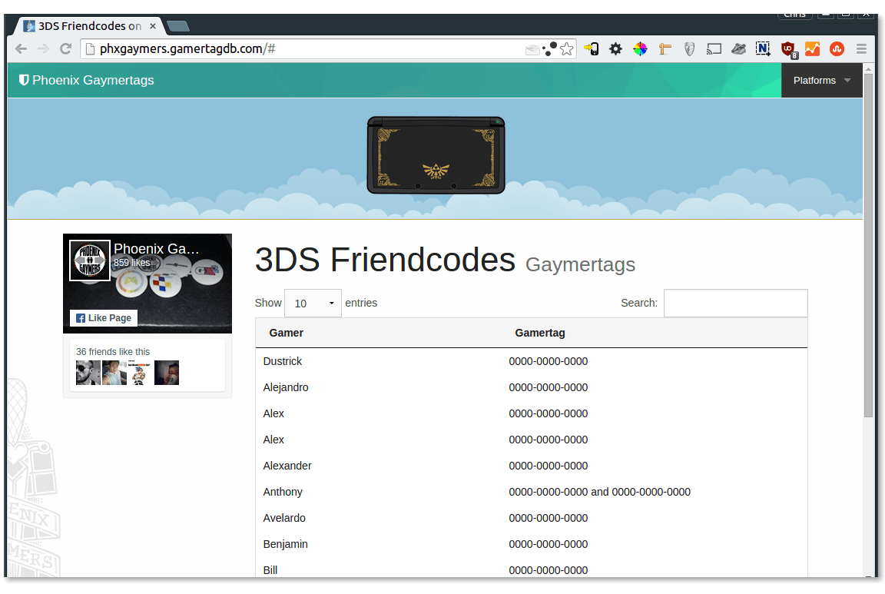

# Gamertag browser

> Browse member gamertags stored in Facebook group documents.

A JavaScript app that lets you browse group member gamertags.

[View demo.](http://phxgaymers.gamertagdb.com)

#### How it works

Gamertag documents are retrieved using the Facebook API and gamertag enteries in the following format are extracted.

    Member Name........ gamertag

### Screenshot

### License

MIT

## Built with

    
    
    
    
    

